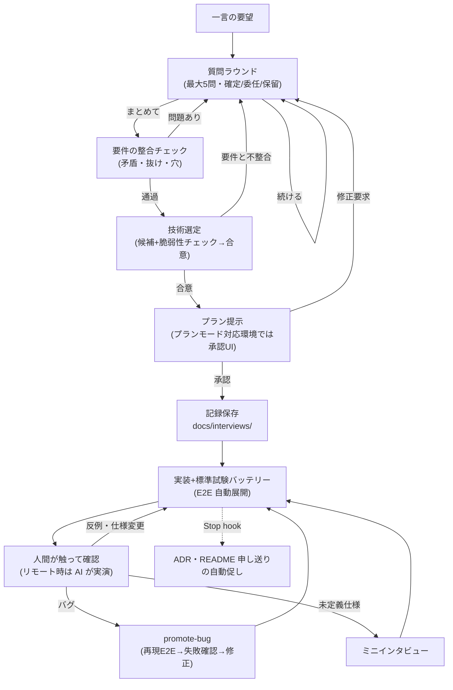

# rally

**バイブコーディングの品質を「事前の網羅試験」ではなく「AI の質問 × 人間の反例出し」の往復で担保する Claude Code プラグイン。**

テニスのラリーのように、AI が質問を打ち、人間が回答・反例を打ち返すことで仕様を確定させます。人間はコードレビューをしません — 代わりに、AI が観点表に沿って仕様を聞き出し、確定した振る舞いは E2E テストに固定され、決定は ADR に残り、失敗は観点表を育てます。

## できること

- **一言の要望から仕様を引き出す**:「タスク管理 CLI を作りたい」だけで、AI が保存先・境界・異常系・スコープを質問し、回答を確定/委任/保留に三分類して仕様化
- **技術選定もインタビューで合意**:候補ライブラリを脆弱性チェック(OSV 照会)付きで提示し、調査報告書を `docs/packages/` に保存
- **確定した仕様は E2E テストに固定**:仕様書とテスト項目書を E2E コードが兼ねる。機械的な試験(境界値・異常系・データ破壊など)は標準バッテリーから自動展開
- **バグは修正前に回帰試験化**:再現テストが失敗するのを確認してから直す
- **未定義の仕様は推測で埋めない**:実装・試験中に「どう動くべきか決まっていない」状況に出会うと、ミニインタビューでユーザーに戻ってくる
- **決定と申し送りが自動で残る**:Stop hook が ADR(`docs/adr.md`)と README 申し送りの更新を促す

## ワークフロー



### 各フェーズでやること

1. **質問ラウンド** — 観点表(6観点:入力異常系/境界/状態と順序/不変条件/解釈の言い直し/スコープ外)から「答えによって実装が最も変わる質問」を最大 5 問選んで提示。回答は**確定**(仕様に固定)/**委任**(AI が仮決めして明記)/**保留**(モック・複数案で次ラウンドへ)に三分類。続けるかまとめるかは毎ラウンド末にユーザーが決める
2. **要件の整合チェック** — まとめ指示を受けたら、ラウンド間の回答の矛盾・確定/委任/保留の反映漏れ・「なし」判断の見直しを実施。問題があれば質問ラウンドに戻り、通過して初めて先へ進む
3. **技術選定** — 実現手段の候補(2〜3案、依存を増やさない案を必ず含む)を、**脆弱性チェック結果付き**で提示してユーザーと合意(下記「セキュリティチェック」参照)。選定後、その技術で全要件が実現できるかを再チェックし、不整合なら質問ラウンドへ戻る
4. **プラン提示 → 承認** — 全ラウンドを統合したプラン(Gherkin 全文+技術選定)を提示(プランモード対応環境では承認 UI)。承認が実装開始の合図。承認直後にインタビュー記録(=プラン資料)を `docs/interviews/` に保存する
5. **実装+標準試験バッテリー** — 確定した Gherkin を E2E 化するのに加え、機械的試験 10 カテゴリ(境界値・入力異常系・データ頑健性・冪等性・状態遷移・往復一致・不変条件・出力契約・環境依存・スケール)から該当分を**確認なしで自動展開**。機械的な欠陥を人間に発見させないため
6. **人間が触って確認** — 仕様の解釈・使い心地という機械化できない部分だけを人間が見る。リモート(モバイル)利用時は AI が実際にコマンドを実行し、未加工の出力を見せる
7. **バグ(promote-bug)** — 修正前に再現 E2E を書き、**失敗することを確認してから**直す。修正後は「このバグはインタビューで防げたか」を判定し、防げたなら観点表に教訓を追記
8. **ミニインタビュー** — 実装・試験・実演中に「どう動くべきか未定義」の状況(テストの期待値が仕様から導けない場合を含む)に出会ったら、AI の推測で埋めず選択肢 1〜2 問で確認。確定分は記録・ADR・E2E に追記
9. **Stop hook** — ターン終了時、ADR 未反映の決定があれば `docs/adr.md` と README 申し送りの更新を 1 回だけ促す(rally 未使用プロジェクトでは沈黙)

## スキル一覧

| スキル | 内容 |
|---|---|
| `spec-interview` | 観点表に沿った質問ラウンド(1 ラウンド最大 5 問)で壁打ちし、回答を確定/委任/保留に三分類。まとめ指示で要件の整合チェック → 技術選定(脆弱性チェック付きでユーザーと合意)→ プラン提示。承認が実装開始の合図。実装時は標準試験バッテリーを自動展開 |
| `promote-bug` | バグを修正する前に再現試験を E2E 層へ昇格させる(失敗するのを確認してから直す)。期待挙動が未定義ならミニインタビューへ |
| `spec-digest` | E2E(仕様の正)と ADR から人間可読の仕様書 `docs/spec.md` を生成・再生成。フォーマットは固定テンプレートで、再生成しても構成が変わらない |

## セキュリティチェック(spec-interview に内蔵)

技術選定で外部パッケージを候補にするとき、**選定の時点で**候補ごとに脆弱性を調査します:

- **既知脆弱性**: OSV(osv.dev)に照会(`osv-scanner` があればそれでも可)
- **サプライチェーン**: WebSearch が使える環境では「CVE / vulnerability」「security advisory / suspicious update」の 2 系統で検索し、OSV 登録前の乗っ取りリリース等も拾う
- **OSV 対象外のもの**(インストーラ導入の CLI・商用 SDK・拡張機能など)は WebSearch(CVE・NVD・ベンダーアドバイザリ)で調査
- 調査結果は `docs/packages/<パッケージ名>.md` に報告書として保存(調査済みキャッシュを兼ねる)
- 判定が **has_issues** の候補は推奨されない。どうしても必要な場合は問題点を明示してユーザーの判断を仰ぐ(黙って採用しない)

## hooks

Stop hook が、**rally のスキルを実際に使ったプロジェクトでのみ**、確定・仮決めした決定の `docs/adr.md` への一言追記と README「申し送り」節の更新を促します。

- rally 未使用のプロジェクトには一切干渉しません(判定は `docs/interviews/` の存在 = spec-interview だけが作るディレクトリ。transcript に依存しないため、リモートコントロールセッションでも動作)
- 発火条件はインタビュー記録・E2E の最終更新が `docs/adr.md` より新しいこと(= ADR 未反映の決定がある)。対応済みなら沈黙
- ループ防止: `stop_hook_active` ガード+プロジェクト単位の 30 分クールダウン

## 生成・維持される資産

rally が維持する恒久資産は 4 つだけです。それ以外(設計書・図など)は必要時に再生成する派生物として扱います。

| 資産 | 場所 | 役割 |
|---|---|---|
| 振る舞い仕様(E2E) | `tests/e2e/` | **唯一の最新仕様**。試験項目書を兼ねる |
| ADR | `docs/adr.md` | 決定と理由・捨てた案の一言記録 |
| コード | `src/` など | 実装本体 |
| 観点表 | プラグイン同梱+`.claude/rally-checklist.md` | 質問の元ネタ。失敗のたびに育てる |

補助資料: `docs/interviews/`(壁打ちの記録=プラン)、`docs/packages/`(依存の脆弱性調査報告)、`docs/spec.md`(spec-digest で生成する読み物仕様書)。

## インストール

```
/plugin marketplace add shiyu9/rally
/plugin install rally@rally
```

開発版をローカルで試す場合:

```
git clone https://github.com/shiyu9/rally.git
claude --plugin-dir ./rally/plugins/rally
```

## 使い方(クイックスタート)

1. プロジェクトで Claude Code を開き、作りたいものを一言で伝える(例:「家計簿 CLI を作りたい」)
2. AI の質問に答える。分からなければ「任せる」でよい(委任も正式な回答)
3. 聞き足りなければ壁打ちを続け、十分になったら「**まとめて**」
4. 提示されたプランを承認すると実装が始まる
5. できたものを触る(リモートなら「実行して出力を見せて」)。期待と違えば反例を出す
6. バグには「バグだね、直して」の一言 — 修正前に再現テストが書かれる
7. 「**仕様書を作って**」で `docs/spec.md` を生成

## プロジェクト固有の観点表

プラグイン同梱の汎用観点表に加えて、プロジェクトルートに `.claude/rally-checklist.md` を置くと固有の観点を質問に反映できます:

```markdown
# プロジェクト固有観点表

## 固有観点
- **データの永続化先**:このプロジェクトでは保存先を毎回確認する

## 育成ログ
(観点漏れが起きたらここに日付・教訓・反映先を追記)
```

無ければ rally が必要時に作成を提案します。

## 前提条件

- Claude Code(プラグイン対応バージョン)
- **Python 3**(PATH 上に `python`)— Stop hook のスクリプト実行に必要
- `curl` — 技術選定時の OSV(脆弱性データベース)照会に使用(Windows 10+/macOS/Linux 標準搭載)

## 適用範囲について

rally は**失敗コストが低い領域**(個人ツール・プロトタイプ・社内ユーティリティ等)を想定しています。決済・データ破壊・セキュリティ等のクリティカル領域は、バイブコーディング自体を避けてください。

## ライセンス

MIT
